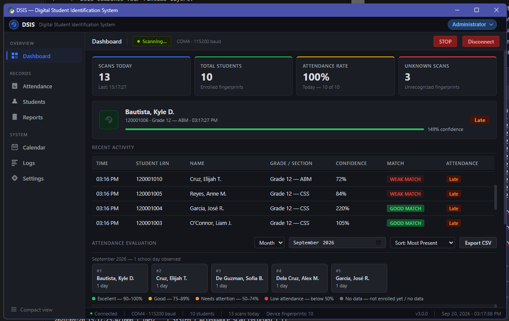
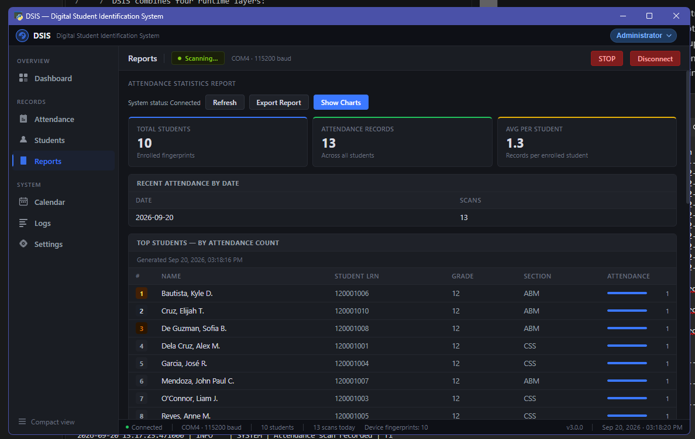

<div align="center">


# Digital Student Identification System

**DSIS** is a school-focused digital identification and attendance platform built around an ESP32 fingerprint device and a Windows desktop application.

<p>
  
  
  
  
  
</p>

<p>
  <a href="#features">Features</a> ·
  <a href="#installation">Installation</a> ·
  <a href="#hardware">Hardware</a> ·
  <a href="#documentation">Documentation</a> ·
  <a href="#project-structure">Project Structure</a>
</p>

</div>

---

## Overview

**Digital Student Identification System (DSIS)** is a modular student identification and attendance application designed for school and training-center workflows.

The system combines an **ESP32 + AS608 fingerprint sensor** with a Windows desktop application. The hardware performs fingerprint enrollment and identification, while the desktop application manages student records, attendance history, reports, backups, permissions, device communication, and diagnostics.

The current maintained interface is the **v3 HTML/pywebview application**. The browser UI communicates with Python through `window.pywebview.api`; the application does not require a local web server.

> **Project status:** Active development. Hardware, firmware, desktop software, and documentation are maintained together in this repository.

> **Documentation status:** The canonical current guides are grouped under [`docs/`](docs/README.md): User Guide, Architecture, Hardware, Development, Troubleshooting, History, and API. v1 CustomTkinter and v2 Qt material is retained for lineage and comparison; it is not the supported launch path. Generated and forensic reports are scoped to their recorded snapshot.

## Features

### Student Identification

- Fingerprint enrollment and identification
- Fingerprint deletion and device wipe support
- Student record management
- Confidence-aware scan processing
- Attendance cooldown handling to prevent repeated scans

### Attendance Management

- Daily attendance recording
- Attendance history and reporting
- Day, week, and month evaluation windows
- Attendance-rate categories
- CSV export for attendance evaluation and reports

### Desktop Application

- Windows desktop application powered by HTML/pywebview
- Dashboard, Attendance, Students, Reports, Logs, and Settings sections
- Role-based UI permissions
- Device discovery and connection status
- Serial diagnostics and firmware assistance
- Local SQLite database
- Database backups and runtime logging

### Security

- Role-based application permissions
- Password storage using a salted **PBKDF2-HMAC-SHA256** password hash
- Plaintext administrator passwords are not stored or logged
- Local-first architecture for student and attendance data

---

## Screenshots

### Dashboard



### Attendance / Fingerprint Report



> Screenshots show the current application interface and may change as DSIS continues to evolve.

---

## System Architecture

```text
┌──────────────────────────────┐
│        Student / Staff       │
└──────────────┬───────────────┘
               │
               ▼
┌──────────────────────────────┐
│      DSIS Windows App        │
│      HTML + pywebview        │
│                              │
│ Dashboard · Attendance       │
│ Students · Reports · Logs    │
│ Settings · Permissions       │
└──────────────┬───────────────┘
               │
        USB Serial / 115200
               │
               ▼
┌──────────────────────────────┐
│            ESP32             │
│ Device communication layer   │
└──────────────┬───────────────┘
               │
         UART / 57600
               │
               ▼
┌──────────────────────────────┐
│      AS608 Fingerprint       │
│           Sensor             │
└──────────────────────────────┘

          Local application data
                   │
                   ▼
             ┌──────────┐
             │  SQLite  │
             └──────────┘
```

### Serial communication

| Connection | Baud rate | Purpose |
| --- | ---: | --- |
| PC ↔ ESP32 | **115200** | DSIS desktop communication |
| ESP32 ↔ AS608 | **57600** | Fingerprint sensor UART |

**Important:** The desktop application uses **115200 baud**. The **57600 baud** connection is internal to the ESP32 and AS608 sensor.

---

## Installation

### Requirements

Before installing DSIS, prepare:

- Windows PC
- Python environment compatible with the project dependencies
- ESP32 development board
- AS608 fingerprint sensor
- USB data cable
- Appropriate USB-to-serial driver for the ESP32 board

### 1. Clone the repository

```bash
git clone https://github.com/Jayden-Dollaga/Digital-Student-Identification-System.git
cd Digital-Student-Identification-System
```

### 2. Install Python dependencies

```bash
python -m pip install -r requirements.txt
```

### 3. Prepare the ESP32

Upload the maintained all-in-one firmware using Arduino IDE. Hardware wiring, supported boards, firmware instructions, and setup notes are documented in:

- [Installation Guide](INSTALLATION.md)
- [Firmware](firmware/)

### 4. Connect the device

Connect the ESP32 to the PC using a **data-capable USB cable**.

If Windows does not create a COM port, install the USB driver that matches the USB interface chip on the board.

### 5. Launch DSIS

For the maintained v3 desktop application:

```text
run_web_gui.bat
```

or:

```bash
python run_web_gui.py
```

The application starts in the **Guest** role. On first run, DSIS requires the operator to create an administrator password; there is no built-in default administrator password. The password must be at least 8 characters and is stored as a salted PBKDF2-HMAC-SHA256 hash.

For packaged Windows deployment, see the [Portable Build Guide](PORTABLE_BUILD.md).

---

## USB Serial Drivers

Windows requires a driver for the USB interface used by the ESP32 development board.

Check:

### Device Manager: Ports (COM & LPT)

If the board is not detected, identify the USB bridge chip and install its corresponding driver.

| USB interface | Driver / source |
| --- | --- |
| CP210x | [Silicon Labs CP210x VCP Drivers](https://www.silabs.com/developers/usb-to-uart-bridge-vcp-drivers) |
| CH340 / CH341 | [WCH CH34x Drivers](https://www.wch-ic.com/downloads/CH343SER_ZIP.html) |
| CH9102 | Driver supplied by the board manufacturer or WCH |
| FT232 family | [FTDI VCP Drivers](https://ftdichip.com/drivers/vcp-drivers/) |
| ESP32-S2/S3/C3 native USB | Depends on board and firmware configuration |

> Installing Python packages does **not** install Windows USB drivers.

---

## Attendance Evaluation

DSIS includes an attendance evaluation system for **day, week, and month** reporting windows.

The evaluation system:

1. Counts distinct attendance dates for each student.
2. Compares attendance against observed school days.
3. Calculates the corresponding attendance rate.
4. Groups results into the application's attendance categories.
5. Allows the current evaluation to be exported as CSV.

Attendance Evaluation uses the dedicated `attendance_evaluation` permission. In the default role configuration, Administrator, Teacher, and Guest can view evaluation data; CSV export remains controlled by the `export` permission.

For the detailed workflow, see the [v3 Workflow Guide](docs/UserGuide/v3-workflows.md).

---

## Hardware

### Current hardware stack

| Component | Role |
| --- | --- |
| **ESP32** | Device controller and PC communication |
| **AS608** | Fingerprint enrollment and identification |
| **Windows PC** | DSIS desktop application and local database |
| **USB connection** | PC ↔ ESP32 communication |

The project is designed as a modular system, allowing additional identification hardware and peripherals to be integrated as the project develops.

---

## Documentation

The repository contains documentation for users, developers, hardware setup, troubleshooting, and deployment.

| Document | Description |
| --- | --- |
| [Installation](INSTALLATION.md) | Hardware, software, firmware, and driver setup |
| [Portable Build](PORTABLE_BUILD.md) | Windows packaging and deployment |
| [v3 Workflow Guide](docs/UserGuide/v3-workflows.md) | Daily application workflows |
| [Troubleshooting](docs/Troubleshooting/README.md) | Common connection and application problems |
| [Documentation Index](docs/INDEX.md) | Documentation directory |
| [Documentation Map](docs/Development/documentation-map.md) | Developer documentation structure |
| [Contributing](CONTRIBUTING.md) | Contribution and development guidelines |
| [Release Guide](RELEASE.md) | Release and packaging process |

---

## Project Structure

```text
Digital-Student-Identification-System/
├── python/                 # Desktop application, services, database, UI
├── firmware/               # ESP32 + AS608 firmware
├── data/                   # Runtime data, settings, backups, logs
├── tests/                  # Automated tests and UI prototypes
├── tools/                  # Diagnostics and packaging utilities
├── docs/                   # User and developer documentation
├── archive/                # Historical and experimental components
├── Build/                  # Packaging specifications
├── run_web_gui.py          # v3 application launcher
├── run_web_gui.bat         # Windows launcher
├── requirements.txt        # Python dependencies
└── README.md               # Project documentation
```

The former Qt and CustomTkinter interfaces are retained under `archive/legacy-ui/` for reference and are **not the current application launchers**.

---

## UI Prototypes

Experimental interface prototypes are located under [`tests/Prototype/`](tests/Prototype/). They are isolated previews and do not replace the maintained v3 application.

Available prototypes include:

```bash
python tests/Prototype/run_qt_prototype.py
python tests/Prototype/run_hybrid_prototype.py
python tests/Prototype/run_task_manager_variant.py
python tests/Prototype/original_ui.py
python tests/Prototype/run_original_ui_display.py
python tests/Prototype/run_combined_ui.py
```

These prototypes are useful for evaluating navigation, identification workflows, layouts, and visual concepts before changes are integrated into the production interface.

---

## Development

DSIS contains multiple components that are developed together:

- **Desktop application** — Python, HTML, CSS, JavaScript, and pywebview
- **Firmware** — ESP32 / Arduino
- **Fingerprint integration** — AS608 sensor communication
- **Database** — SQLite
- **Testing** — automated regression and integration tests
- **Documentation** — user, hardware, security, and development guides

For development standards and repository conventions, start with [CONTRIBUTING.md](CONTRIBUTING.md).

---

## Security & Privacy

DSIS is designed around a local-first workflow. Student and attendance information is maintained by the local application and database rather than requiring a cloud service for normal operation.

Administrators should still apply appropriate safeguards when deploying DSIS in a school environment, including:

- Protecting the Windows machine running DSIS
- Using a strong administrator password created during first-run setup
- Restricting access to application backups and database files
- Following applicable school data-protection and privacy requirements
- Avoiding the distribution of real student data in public development builds

---

## License

See [LICENSE](LICENSE) for the project's license and usage terms.

---

<div align="center">

**Digital Student Identification System (DSIS)**  
*Modular digital identification and attendance for educational environments.*

</div>
