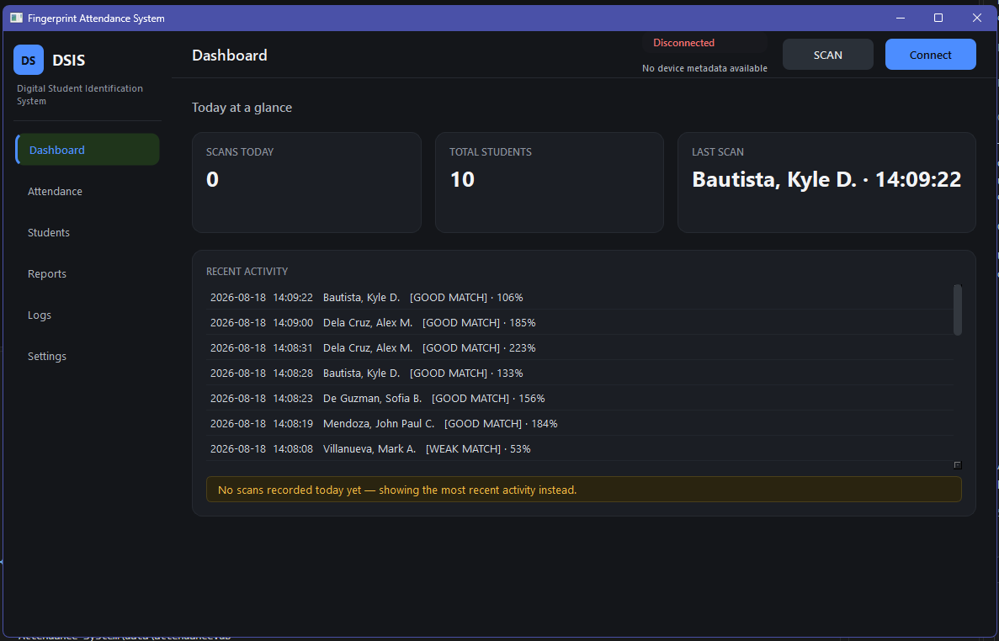
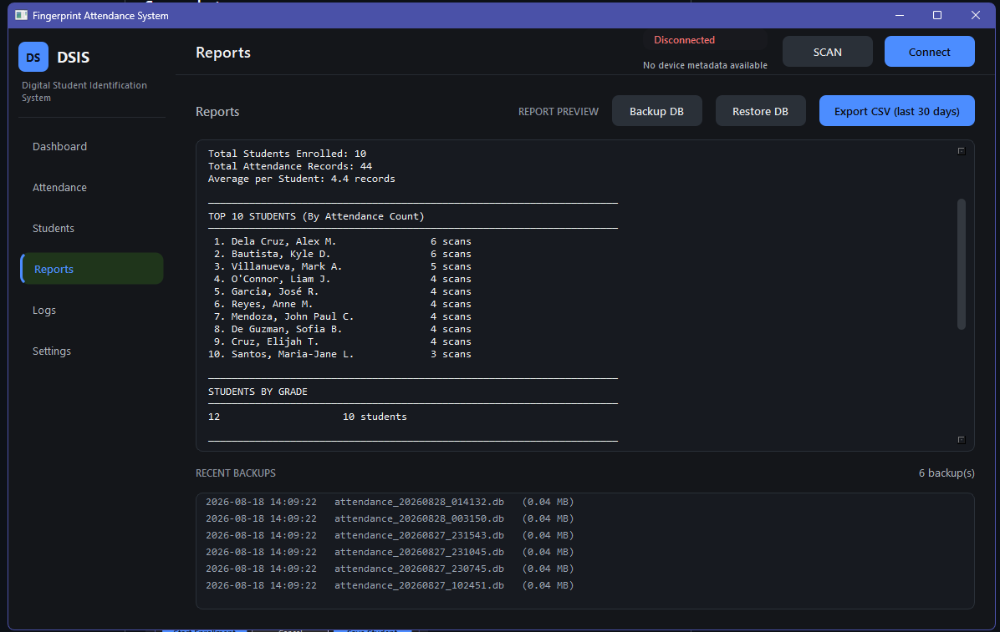

# Digital Student Identification System

DSIS is a Windows desktop attendance system for schools and training centers. An ESP32 and AS608 fingerprint sensor handle enrollment and identification; the Python application manages student records, attendance history, reports, backups, and serial communication.

## Features

- Fingerprint enrollment, matching, deletion, and device wipe
- SQLite student and attendance records
- Qt dashboard, attendance, students, reports, logs, and settings pages
- Attendance cooldown handling and confidence-aware scan processing
- CSV/report exports and database backups with role-based UI permissions
- ESP32 device discovery, connection status, firmware assistance, and serial diagnostics

## Screenshots





## Quick Start

1. Install Python and project dependencies:

   ```text
   python -m pip install -r requirements.txt
   ```

2. Install the USB serial driver that matches the bridge chip on your ESP32 board. CP210x is correct for Silicon Labs boards; CH340/CH341, CH9102, FTDI, and native-USB boards need their corresponding driver or Windows support. See [Installation](INSTALLATION.md).

3. Upload the all-in-one firmware once using Arduino IDE. See [Installation](INSTALLATION.md) for wiring, board, and firmware details.

4. Connect the ESP32 with a data-capable USB cable, close other serial monitors, and launch the active Qt application:

   ```text
   run_qt_gui.bat
   ```

For packaged Windows deployment, see [Portable Build](PORTABLE_BUILD.md). For connection problems, see [Troubleshooting](docs/TROUBLESHOOTING.md). Contributors should start with [Contributing](CONTRIBUTING.md) and [Release Guide](RELEASE.md).

The PC-to-ESP32 USB serial connection uses **115200 baud**. The separate ESP32-to-AS608 sensor UART uses **57600 baud** internally; do not select 57600 in the desktop app.

## USB Serial Drivers

Windows needs a driver for the USB interface chip on the board, not for the ESP32 brand itself. Check **Device Manager > Ports (COM & LPT)** and install the matching vendor driver if the board does not appear as a COM port:

- [Silicon Labs CP210x VCP drivers](https://www.silabs.com/developers/usb-to-uart-bridge-vcp-drivers) for CP210x boards, including the CP210x Universal Windows Driver.
- [WCH CH34x drivers](https://www.wch-ic.com/downloads/CH343SER_ZIP.html) for CH340/CH341 boards.
- WCH CH9102 driver for boards identified as CH9102; use the driver supplied by the board manufacturer or WCH.
- [FTDI VCP drivers](https://ftdichip.com/drivers/vcp-drivers/) for FT232-family boards.
- Native-USB ESP32-S2/S3/C3 boards may use USB CDC or USB-JTAG instead of a USB-UART bridge. Their support depends on the board and firmware configuration and is not verified by this project.

Installing Python packages does not install Windows USB drivers. The application can use an unfamiliar adapter when Windows exposes it as a COM port and the device answers the DSIS handshake.

## Active Interfaces

The maintained desktop interface is the PySide6/Qt application launched by [run_qt_gui.py](run_qt_gui.py) or [run_qt_gui.bat](run_qt_gui.bat). The older CustomTkinter interface remains available through [run_app.bat](run_app.bat) for compatibility and is not the primary workflow.

## Project Structure

| Path | Purpose |
| --- | --- |
| `python/` | Python application, services, serial handling, database, and UI code |
| `firmware/` | ESP32 and AS608 Arduino sketches |
| `data/` | Runtime settings, database, backups, logs, and charts |
| `tests/` | Automated regression and integration tests |
| `tools/` | Diagnostics, packaging helpers, and maintenance scripts |
| `docs/` | User, architecture, hardware, development, security, and generated documentation |
| `archive/` | Historical and experimental material retained for reference |

See the [documentation index](docs/INDEX.md) for the full map.

## License

See [LICENSE](LICENSE).

Last verified: 2026-09-03, against the current `main` branch
