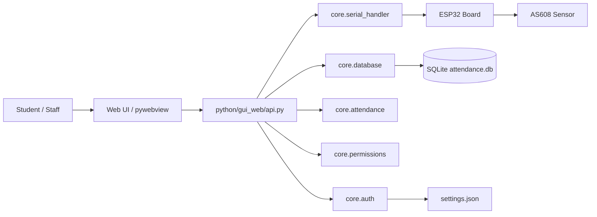

# v3 System Architecture

The maintained DSIS runtime is a desktop application built around pywebview and a Python backend.

## Core layers

### 1. UI layer

The frontend is rendered in a native app window and loads HTML/JS/CSS from `python/gui_web/web/`.

### 2. Bridge layer

`python/gui_web/api.py` exposes Python methods to JavaScript via `window.pywebview.api`.

### 3. Backend logic layer

This includes:

- `core.database` — persistence and schema
- `core.serial_handler` — UART and port handling
- `core.attendance` — match processing and cooldown
- `core.attendance_status` — status evaluation
- `core.permissions` — role and session gating
- `core.auth` — password hashing and verification

### 4. Device layer

The ESP32 is the sensor controller and the AS608 is the fingerprint reader. Device communication uses a USB COM port from the PC to the ESP32, with a UART link between the ESP32 and AS608.

## Runtime loop

1. The app loads or creates settings.
2. It opens the pywebview window.
3. JS calls the API for device connection, scanning, enrollment, or reporting.
4. Backend logic writes to SQLite or sends commands to the serial device.
5. Device replies are parsed and surfaced back to the UI as events.

## Threading and background behavior

The app uses background behavior for:

- serial read loops,
- auto-backup checks,
- login/session idle handling,
- log mirroring into the UI.

These are all live runtime concerns and are not separate server processes.
